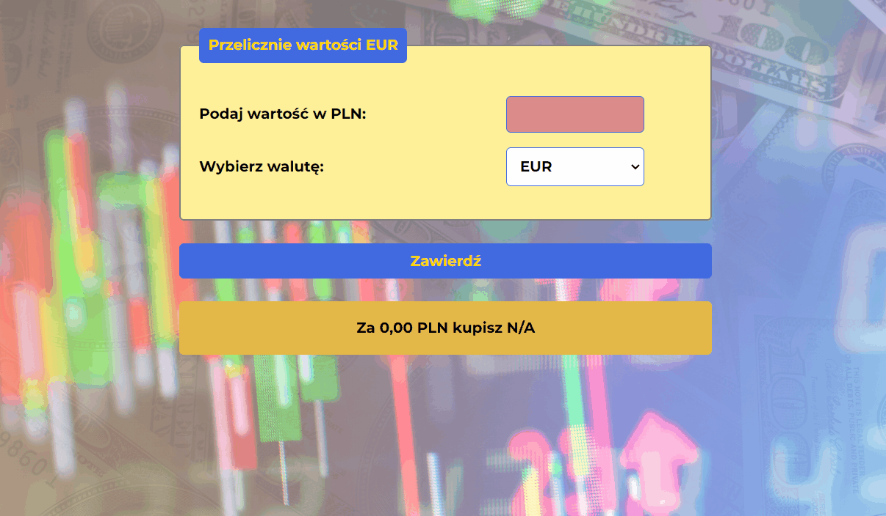

# Currency converter
## Currency calculator
New version

Previous version

It is a currency calculator that is used to convert the PLN currency value to such currencies as:

- EUR
- USD
- GBP

##Demo

https://waltad.github.io/currency-converter/

## Instruction
1. Enter the value in PLN in the first field.
2. Select a currency in the second field.
3. Click or select the "Zatwierdź" ("Approve") box.
## Tech

Currency converter uses a number of open source projects to work properly:

- [HTML] - HyperText Markup Language
- [JS] - JavaScript
- [CSS] - Cascading Style Sheets

## Installation

No installation required

## Development

This project was done as part of an exercise in a Java Script course.
The project will be developed as new skills are acquired

## Lice

Free license